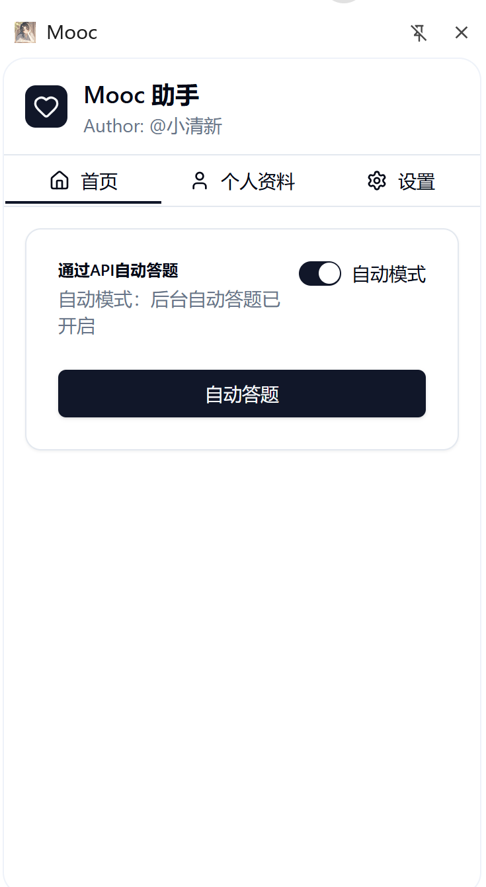
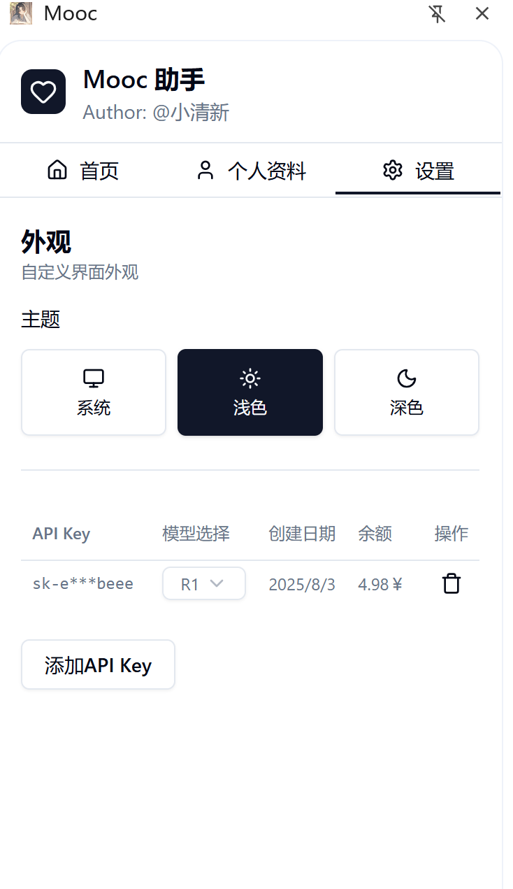

# mooc_plugin

## 📖 简介
**mooc_plugin** 是一个基于 **Plasmo、React、TailwindCSS、Shadcn/UI** 开发的浏览器扩展插件，结合多种现代前端工具和 UI 组件库，旨在为 MOOC 等在线学习平台提供增强功能和更流畅的使用体验。

插件集成了 OpenAI API、UI 动画、日期选择、数据存储等多种能力，方便快速扩展新功能。

---

## 🖼 系统截图
> 以下为示例截图，可替换为你项目的真实图片

首页  


课程页面增强效果  


设置页面  


---

## 🛠 使用的技术与依赖
- **插件框架**: [Plasmo](https://docs.plasmo.com/)  
- **UI 框架**: [React](https://react.dev/) + [TailwindCSS](https://tailwindcss.com/docs/installation) + [shadcn/ui](https://ui.shadcn.com/)  
- **UI 组件**: Radix UI（Accordion、Avatar、Dialog、Tabs 等）  
- **图标库**: [lucide-react](https://lucide.dev/icons/)  
- **网络请求**: [axios](https://axios-http.com/)  
- **主题切换**: [next-themes](https://github.com/pacocoursey/next-themes)  
- **日期处理**: [date-fns](https://date-fns.org/) + [react-day-picker](https://react-day-picker.js.org/)  
- **动画**: [tw-animate-css](https://www.npmjs.com/package/tw-animate-css)  
- **数据存储**: [@plasmohq/storage](https://docs.plasmo.com/advanced/storage)  
- **消息通信**: [@plasmohq/messaging](https://docs.plasmo.com/advanced/messaging)  
- **HTML 解析**: [node-html-parser](https://github.com/taoqf/node-html-parser)  
- **AI 接口**: [openai](https://www.npmjs.com/package/openai)  

---

## 🚀 脚本命令
# 启动开发环境
```
pnpm run dev
```


# 构建开发包
```
pnpm build
```


# 构建并打包插件（可直接加载到浏览器）
```
pnpm package
```


# 构建生产版本
```
pnpm build:production
```


---

## ✨ 已有功能）

* [x] 本地数据存储
* [x] AI 自动答题功能（OpenAI 接口）
* [x] 手动答题功能(经过处理的答案填入自动答题框)
* [x] 主题切换（浅色/深色模式）
* [x] UI 动画与过渡效果

---

## 📦 打包与安装

1. 执行打包命令：

   ```bash
   pnpm build

2. 打开浏览器扩展管理页面：

   * Chrome/Edge: `chrome://extensions/`
   * Firefox: `about:debugging#/runtime/this-firefox`
3. 开启 **开发者模式**
4. 选择 **加载已解压的扩展程序** 并选择 `build` 目录

---

## 📬 联系方式

* Author: **shack**
* Email: [2053540371@qq,com](2053540371@qq.com)

---

## ⭐ Star History

[](https://star-history.com/#hishack/-mooc_plugin&Date)

